<div align="center">


**A beautiful CLI tool to see & manage what's running on your ports ✨**

[](https://github.com/Neilblaze/portscope/pkgs/npm/portscope)
[](LICENSE)
[](https://nodejs.org)

</div>


## WTF is this? 🤔

Stop guessing which process is hogging port 3000! 🛑

Eliminate the operational friction of diagnosing port collisions and orphaned workloads. PortScope is an advanced CLI observability suite that aggregates real-time metrics from active development servers, databases, and system daemons into a high-fidelity control plane. Engineered with heuristic framework detection and native Docker container mapping, it accelerates local debugging by providing intelligent context aggregation, interactive process lifecycle management, and integrated AI orchestration for natural language state querying.


<br/>

> [!NOTE]  
> ### An important question to ask is: Why not use a `skill.md` instead? <br/>
> 
> Well, essentially two reasons,
> <br/>
> 1. A plain `skills.md` doesn’t behave well with smaller/local models. They don’t have strong instruction hierarchy or long-context discipline, so they either ignore it or overfit to it. In a tool-driven loop (like this CLI setup), that becomes unstable, because the model can’t reliably separate system intent from user intent or tool state. <br/> <br/> Also, considering slightly larger setups (think sandboxed REPL-style agents), “skills” are usually mediated through structured tool schemas, guarded execution, and controlled context injection. That layer acts like a safety boundary between the model and the runtime ... and a raw `skills.md` *bypasses that and gets dumped straight into the prompt*, so there’s no isolation, no validation, and no execution guardrails. On smaller/local models, that can lead to prompt pollution (or better [context rot](https://www.trychroma.com/research/context-rot)), bad tool calls, or the model hallucinating actions it shouldn’t take. <br/> <br/>
> 2. I also have another take (honest one): it’s also just more fun and flexible this way. Most people running this aren’t on big sandboxed models, they’re on cheaper or local SLMs. A naive `skills.md` dump can actually mess with the model’s flow instead of helping it.

<br/>


## What it looks like 😎

<div align="center">

https://github.com/user-attachments/assets/41009a31-9a40-4503-b4d4-54698eca2148

PortScope stays alive after showing your ports — type commands, ask questions in natural language, or use `/help` for the full command list.
</div>

---

## Install

```bash
npm install -g github:Neilblaze/portscope
```

Or run it directly without installing:

```bash
npx github:Neilblaze/portscope
```

> [!TIP]
> You can install and run it directly using [Claude Code](https://claude.com/product/claude-code) / [Gemini CLI](https://geminicli.com).

---

## Usage

### Interactive mode (default)

```bash
portscope
```

Shows your port table and drops into an interactive prompt. From there you can:

- **Type a port number** (e.g. `3000`) → inspect it
- **Type a command** (e.g. `kill 3000`, `ps`, `clean`) → execute it
- **Ask in natural language** (e.g. `"what's using the most CPU?"`) → AI answers and acts
- **Use slash commands** (`/provider`, `/models`, `/help`) → configure AI
- **Fish-style Autocomplete** — Intelligent ghost-text suggestions appear as you type (press `→` to accept)

Type `exit` or press `Ctrl+C` to quit.

> [!TIP]
> You can launch PortScope with the `--verbose` flag (e.g. `portscope --verbose`) to enable real-time SSE streaming for AI responses, complete with token metrics and latency stats.

### Show all listening ports

```bash
portscope --all
```

Includes system services, desktop apps, and everything else listening on your machine.

### Inspect a specific port

```bash
portscope 3000
# or
whoisonport 3000
```

Detailed view: full process tree, repository path, current git branch, memory usage.

### Kill a process

```bash
portscope kill 3000                # kill by port
portscope kill 3000,5173,8080      # kill comma-separated
portscope kill 3000-3010           # kill a port range
portscope kill 42872               # kill by PID
portscope kill -f 3000             # force kill (SIGKILL)
portscope kill all                 # kill all dev server ports
```

> [!IMPORTANT]
> `portscope kill all` and all destructive operations **always** require explicit `y/N` confirmation — including when initiated by AI.

Port ranges expand into individual kills — empty ports are silently skipped:

```
$ portscope kill 3000-3005

  Killing :3000 — node (PID 41245)
  ✓ Sent SIGTERM to :3000 — node (PID 41245)
  Killing :3001 — node (PID 91248)
  ✓ Sent SIGTERM to :3001 — node (PID 91248)

  Range summary: 2 killed, 4 empty
```

### Pause / Resume a process

```bash
portscope pause 3000              # suspend (SIGSTOP) — frees CPU, keeps state
portscope resume 3000             # resume (SIGCONT)
```

Useful for temporarily freeing resources — e.g., pausing a 10 GB inference server to run a Docker build, then resuming it.

> [!NOTE]
> Pause/resume uses POSIX `SIGSTOP`/`SIGCONT` and is available on macOS and Linux. Not supported on Windows.

### View process logs

```bash
portscope logs 3000               # show last 50 lines and exit
portscope logs 3000 -f            # follow (stream new lines)
portscope logs 3000 --lines 10    # show last 10 lines
portscope logs 3000 --err         # stderr only
```

Discovers log files automatically using `lsof` file descriptor detection. Falls back to system log (`log show` on macOS, `journalctl` on Linux) when no log files are found.

```
$ portscope logs 3000 --lines 5

  PortScope — logs for :3000 (node, PID 41245)

  ▸ Tailing stdout: /tmp/next-dev.output

  ▲ Next.js 16.2.4 (Turbopack)
  - Local: http://localhost:3000
  ✓ Ready in 192ms
   GET / 200 in 920ms
   GET /api/auth/session 200 in 5ms
```

### Show all dev processes

```bash
portscope ps
```

A beautiful `ps aux` for developers — full process names, CPU%, memory, framework detection, environment detection (dev/prod/test/staging), and a smart description column.

```
$ portscope ps

╭───────┬─────────────┬──────┬──────────┬──────────┬───────────┬─────┬─────────┬────────────────────────────────╮
│ PID   │ PROCESS     │ CPU% │ MEM      │ PROJECT  │ FRAMEWORK │ ENV │ UPTIME  │ WHAT                           │
├───────┼─────────────┼──────┼──────────┼──────────┼───────────┼─────┼─────────┼────────────────────────────────┤
│ 584   │ Docker      │ 1.5  │ 842.1 MB │ —        │ Docker    │ —   │ 2d 5h   │ 12 processes                   │
├───────┼─────────────┼──────┼──────────┼──────────┼───────────┼─────┼─────────┼────────────────────────────────┤
│ 32194 │ python3     │ 0.4  │ 45.2 MB  │ backend  │ Python    │ dev │ 5h 10m  │ uvicorn main:app --reload      │
├───────┼─────────────┼──────┼──────────┼──────────┼───────────┼─────┼─────────┼────────────────────────────────┤
│ 21245 │ node        │ 0.2  │ 112.5 MB │ frontend │ Node.js   │ dev │ 45m     │ vite                           │
╰───────┴─────────────┴──────┴──────────┴──────────┴───────────┴─────┴─────────┴────────────────────────────────╯

  3 processes  ·  --all to show everything
```

### Other commands

```bash
portscope clean         # Kill orphaned/zombie dev servers
portscope watch         # Monitor port changes in real-time (with live traffic metrics)
portscope chat          # Jump directly into AI chat mode
```

**Watch mode** displays live metrics for every active port including Memory Usage (RAM), Process Uptime, Bind Address (127.0.0.1 vs 0.0.0.0), Process ID (PID), active connection counts, request rates (req/s), and real-time Bandwidth / Throughput (`↑...B/s ↓...B/s`), helping identify load issues and monitor live traffic without additional/external tools.

> [!TIP]
> Aliases `ports` and `whoisonport` also work: `ports kill 3000`, `whoisonport 8080`

### MCP Server Support

PortScope can run as a **Model Context Protocol (MCP)** server, securely exposing its port management and system diagnostic tools to external AI agents like Claude Desktop, Cursor, and Windsurf.

```bash
# Local usage (stdio) - For Claude Desktop, Cursor, etc.
portscope mcp --transport stdio

# Remote/Network usage (SSE) - Stand up a headless HTTP server
portscope mcp --transport sse --port 3000

# Verify the SSE server is working
curl -N http://localhost:3000/sse
```

#### Environment Variables
You can also configure the server by adding the following to your project's `.env` or `~/.portscope/.env`:
- `PORTSCOPE_MCP_PORT=3000` — Overrides the default SSE server port.

#### Capabilities
The MCP Server exposes not just tools, but also prompts and resources to improve AI orchestration:
- **Tools**: 9+ tools including `list_ports`, `inspect_port`, `kill_process`, `get_system_stats`, etc.
- **Prompts**: Access `portscope-help` to provide usage examples directly to the LLM context.
- **Resources**: Access `portscope://status` to read real-time Server Status, uptime, and memory usage.

> [!NOTE]
> When running in MCP mode, destructive tools (like killing processes) run in headless mode and defer confirmation to the client's built-in UI safeguards. The MCP server is blazing fast and dynamically loaded, ensuring zero performance penalty to your standard CLI commands.

---

## AI Chat

PortScope's AI lets you manage ports with natural language — *"kill whatever's on 3000"*, *"show me what's using the most CPU"*, *"stop all dev servers"*. It works right from the default interactive prompt, or via `portscope chat` for a dedicated AI session.

> [!TIP]
> **System Telemetry**: The AI has direct access to a `get_system_stats()` tool. You can ask it to diagnose machine-level performance bottlenecks, check CPU load averages, or analyze memory pressure.

### Supported Providers

| Provider | Default Model | Browse Models | Env Variable |
|----------|--------------|:---:|--------------|
| **Anthropic** | `claude-haiku-4-5` | curated list | `ANTHROPIC_API_KEY` |
| **OpenAI** | `gpt-5-nano` | curated list | `OPENAI_API_KEY` |
| **Google Gemini** | `gemini-2.5-flash` | curated list | `GEMINI_API_KEY` |
| **OpenRouter** | `qwen/qwen3.5-flash-02-23` | ✓ live browse | `OPENROUTER_API_KEY` |
| **NVIDIA NIM** | `deepseek-ai/deepseek-v4-flash` | ✓ live browse | `NVIDIA_API_KEY` |
| **Cerebras** | `llama-4-scout-17b-16e-instruct` | curated list | `CEREBRAS_API_KEY` |
| **Groq** | `llama-3.3-70b-versatile` | curated list | `GROQ_API_KEY` |
| **Ollama (Local)** | `llama3` | ✓ local list | *none — runs locally* |

### Setup

Type `/provider` in the interactive prompt — pick a provider, paste your API key, and you're ready. Keys are validated and saved to `~/.portscope/.env`, and your provider/model choice persists in `~/.portscope/config.json` — no re-configuration needed on restart.

For **Ollama**, no API key is needed — PortScope auto-detects the local server at `localhost:11434`, or you can set your custom endpoint on your own. Just select Ollama via `/provider` and start chatting.

> [!NOTE]
> Ollama provides cost-free, local AI chat using locally running models. Tool-calling (kill, inspect via AI) is not supported — use Ollama for conversational Q&A and cloud providers for full AI orchestration.

### Slash Commands

| Command | Description |
|---------|-------------|
| `/provider` | Switch AI provider and configure API key |
| `/revoke` | Revoke a saved API key |
| `/models` | Browse and select a model (live listing for OpenRouter & NVIDIA NIM) |
| `/model <name>` | Set model directly |
| `/status` | Show current provider, model, and key status |
| `/usage` | Display token consumption and estimated session costs |
| `/history` | List saved conversation sessions |
| `/load <n>` | Restore a previous conversation session |
| `/export [md\|html\|txt]` | Export current conversation to file |
| `/verbose` | Toggle verbose/streaming mode and detailed telemetry |
| `/clear` | Reset conversation history |
| `/help` | List all commands |

### Configuration

<details>
<summary>Environment variables </summary> <br/>

Set in `.env` (project root), `~/.portscope/.env`, or shell environment:

```bash
ANTHROPIC_API_KEY=...
OPENAI_API_KEY=...
GEMINI_API_KEY=...
OPENROUTER_API_KEY=...
NVIDIA_API_KEY=...
CEREBRAS_API_KEY=...
GROQ_API_KEY=...
```

Provider is selected interactively via `/provider` — no env var needed.

</details>

<details>
<summary>Config file </summary> <br/>

Create `portscope.config.json` in your project root or home directory:

```json
{
  "ai": {
    "provider": "anthropic",
    "model": "claude-haiku-4-5",
    "maxTokens": 4096
  },
  "display": {
    "showBanner": true
  }
}
```

</details>

### Security & Permissions

> [!IMPORTANT]
> Destructive operations (kill, kill all, clean) **always** require explicit `y/N` confirmation before executing, even when initiated by the AI.

- **Sudo Interception**: PortScope dynamically intercepts permission errors (`EPERM`) when interacting with root-owned processes (e.g. Docker, system daemons). It safely prompts for `sudo` elevation directly in the terminal without requiring a CLI restart.
- **API Key Masking & Sanitization**: All API keys are automatically masked in the UI and thoroughly sanitized from any error logs to prevent credential leakage.

---

## How it works

Three shell calls, runs in ~0.2s:

1. **`lsof -iTCP -sTCP:LISTEN`** — finds all processes listening on TCP ports
2. **`ps`** (single batched call) — retrieves process details for all PIDs at once: command line, uptime, memory, parent PID, status
3. **`lsof -d cwd`** (single batched call) — resolves the working directory of each process to detect the project and framework

For Docker ports, a single `docker ps` call maps host ports to container names and images.

Framework detection reads `package.json` dependencies and inspects process command lines. Recognizes Next.js, Vite, Express, Angular, Remix, Astro, Django, Rails, FastAPI, and [many others](#framework-detection).

---

## Framework Detection

PortScope automatically detects 40+ frameworks by analyzing process commands, port conventions, and project files. For more context refer below.

<details>
<summary>Supported frameworks </summary> <br/>

1. **JavaScript**: Next.js, Vite, React, Vue, Angular, Svelte, SvelteKit, Remix, Astro, Gatsby, Nuxt, Express, Fastify, NestJS, Hono, Koa
2. **Python**: Django, Flask, FastAPI
3. **Other**: Rails, Go, Rust, Java, Docker, PostgreSQL, Redis, MySQL, MongoDB, nginx, LocalStack, RabbitMQ, Kafka, Elasticsearch, MinIO, Webpack, esbuild, Parcel
4. **MLOps / AI**: vLLM, Triton Inference Server, Ollama, llama.cpp, LM Studio, Jupyter, TensorBoard, Gradio, Streamlit, MLflow

</details>

---

## Flow


---

## Architecture

```mermaid
graph TB
    subgraph CLI_Entry_Point["CLI Entry Point"]
        CLI([src/index.js<br/>Command Router])
    end

    subgraph Command_Layer["Command Layer"]
        DIRECT[Direct Commands<br/>list · inspect · kill<br/>clean · logs · watch · ps]
        INTERACTIVE{{Interactive Mode<br/>REPL + AI Chat}}
    end

    subgraph Scanner_Layer["Scanner Layer - System Introspection"]
        PORTS[Port Scanner<br/>lsof TCP listeners]
        PROCESS[Process Info<br/>ps batch queries]
        FRAMEWORK[Framework Detection<br/>package.json · Docker images]
        ENV[Environment Detection<br/>NODE_ENV · process flags]
        LOGS[Log Discovery<br/>lsof file descriptors]
    end

    subgraph Platform_Abstraction["Platform Abstraction"]
        PLATFORM([Platform Layer<br/>darwin · linux · win32])
        SYSCALLS[System Calls<br/>lsof · ps · docker · git]
    end

    subgraph AI_Orchestration["AI Orchestration"]
        CONVERSATION{{Conversation Manager<br/>message history · tool routing}}
        CLIENT[Multi-Provider Client<br/>Anthropic · OpenAI · Gemini<br/>OpenRouter · NVIDIA · Cerebras<br/>Groq · Ollama]
        EXECUTOR[Tool Executor<br/>permission checks · execution]
        TOOLS[Tool Definitions<br/>list_ports · kill_process<br/>inspect_port · clean_orphaned]
        USAGE[Usage Tracking<br/>tokens · cost estimation]
        HISTORY[Conversation History<br/>save · load · export]
    end

    subgraph UI_Rendering["UI Rendering"]
        TABLES[Table Renderer<br/>cli-table3 · rounded borders]
        MARKDOWN[Markdown Renderer<br/>bold · code · tables]
        SPINNER[Animated Spinner<br/>3×3 grid · action verbs]
        GHOST[Autocomplete<br/>fish-style suggestions]
    end

    subgraph Configuration["Configuration"]
        CONFIG[Config Loader<br/>portscope.config.json<br/>~/.portscope/]
        SCHEMA[Provider Schema<br/>defaults · validation]
    end

    CLI --> DIRECT
    CLI --> INTERACTIVE
    
    DIRECT --> PORTS
    DIRECT --> PROCESS
    DIRECT --> LOGS
    
    INTERACTIVE --> CONVERSATION
    INTERACTIVE --> DIRECT
    
    CONVERSATION --> CLIENT
    CONVERSATION --> EXECUTOR
    CLIENT --> TOOLS
    EXECUTOR --> PORTS
    EXECUTOR --> PROCESS
    EXECUTOR --> LOGS
    
    PORTS --> FRAMEWORK
    PORTS --> ENV
    PORTS --> PLATFORM
    PROCESS --> PLATFORM
    LOGS --> PLATFORM
    
    PLATFORM --> SYSCALLS
    
    DIRECT --> TABLES
    INTERACTIVE --> MARKDOWN
    INTERACTIVE --> GHOST
    CONVERSATION --> SPINNER
    CONVERSATION --> USAGE
    CONVERSATION --> HISTORY
    
    CLI --> CONFIG
    CONVERSATION --> CONFIG
    CONFIG --> SCHEMA

    %% Rounded nodes
    classDef rounded rx:12,ry:12;
    class CLI,DIRECT,INTERACTIVE,PORTS,PROCESS,FRAMEWORK,ENV,LOGS,PLATFORM,SYSCALLS,CONVERSATION,CLIENT,EXECUTOR,TOOLS,USAGE,HISTORY,TABLES,MARKDOWN,SPINNER,GHOST,CONFIG,SCHEMA rounded;

    %% Subgraph styling (pseudo-transparent)
    style CLI_Entry_Point fill:#fcfcfd,stroke:#e5e7eb,stroke-width:1px,stroke-dasharray:4 4
    style Command_Layer fill:#fcfcfd,stroke:#e5e7eb,stroke-width:1px,stroke-dasharray:4 4
    style Scanner_Layer fill:#fcfcfd,stroke:#e5e7eb,stroke-width:1px,stroke-dasharray:4 4
    style Platform_Abstraction fill:#fcfcfd,stroke:#e5e7eb,stroke-width:1px,stroke-dasharray:4 4
    style AI_Orchestration fill:#fcfcfd,stroke:#e5e7eb,stroke-width:1px,stroke-dasharray:4 4
    style UI_Rendering fill:#fcfcfd,stroke:#e5e7eb,stroke-width:1px,stroke-dasharray:4 4
    style Configuration fill:#fcfcfd,stroke:#e5e7eb,stroke-width:1px,stroke-dasharray:4 4

    %% Highlighted nodes
    style CLI fill:#4a9eff,stroke:#2563eb,color:#fff
    style INTERACTIVE fill:#8b5cf6,stroke:#7c3aed,color:#fff
    style CONVERSATION fill:#ec4899,stroke:#db2777,color:#fff
    style PLATFORM fill:#10b981,stroke:#059669,color:#fff
    style SYSCALLS fill:#f59e0b,stroke:#d97706,color:#fff
```




> [!NOTE]
> PortScope provides native OS-level observability and is fully validated across  macOS, Linux, and Windows environments.

---

## Development

```bash
git clone https://github.com/neilblaze/portscope.git
cd portscope
npm install
npm test                   # Run tests
npm start                  # Run locally (interactive mode)
npm run dev                # Same as npm start
node src/index.js --help   # See all commands
```

## Contributing 🤗

Got an idea to make PortScope better? Whether you want to add support for a new framework, optimize the port scanner, or just fix a typo, we'd love to see your pull requests!

> [!IMPORTANT]
> If you are using LLMs or AI assistants to help write code, please review our **[AI Usage Policy](.docs/AI_USAGE_POLICY.md)** to ensure your PR complies with our security and licensing standards.

---

## License 📜

[Apache-2.0](LICENSE)