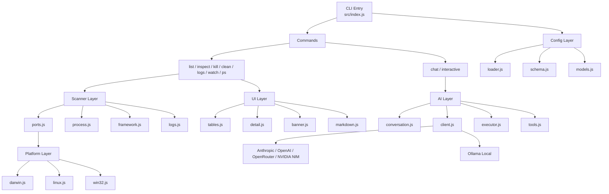

<div align="center">


**A beautiful CLI tool to see & manage what's running on your ports ✨**

[](https://www.npmjs.com/package/portscope)
[](LICENSE)
[](https://nodejs.org)

</div>


## WTF is this?

Stop guessing which process is hogging port 3000! 🛑

Eliminate the operational friction of diagnosing port collisions and orphaned workloads. PortScope is an advanced CLI observability suite that aggregates real-time metrics from active development servers, databases, and system daemons into a high-fidelity control plane. Engineered with heuristic framework detection and native Docker container mapping, it accelerates local debugging by providing intelligent context aggregation, interactive process lifecycle management, and integrated AI orchestration for natural language state querying.


## What it looks like

```
$ portscope

  ██████╗  ██████╗ ██████╗ ████████╗███████╗ ██████╗ ██████╗ ██████╗ ███████╗
  ██╔══██╗██╔═══██╗██╔══██╗╚══██╔══╝██╔════╝██╔════╝██╔═══██╗██╔══██╗██╔════╝
  ██████╔╝██║   ██║██████╔╝   ██║   ███████╗██║     ██║   ██║██████╔╝█████╗
  ██╔═══╝ ██║   ██║██╔══██╗   ██║   ╚════██║██║     ██║   ██║██╔═══╝ ██╔══╝
  ██║     ╚██████╔╝██║  ██║   ██║   ███████║╚██████╗╚██████╔╝██║     ███████╗
  ╚═╝      ╚═════╝ ╚═╝  ╚═╝   ╚═╝   ╚══════╝ ╚═════╝ ╚═════╝╚═╝     ╚══════╝
  🔊 listening to your ports                                          v1.1.1

╭───────┬─────────┬───────┬──────────────────────┬────────────┬────────┬───────────╮
│ PORT  │ PROCESS │ PID   │ PROJECT              │ FRAMEWORK  │ UPTIME │ STATUS    │
├───────┼─────────┼───────┼──────────────────────┼────────────┼────────┼───────────┤
│ :3000 │ node    │ 41245 │ frontend             │ Vue.js     │ 45m    │ ● healthy │
├───────┼─────────┼───────┼──────────────────────┼────────────┼────────┼───────────┤
│ :3001 │ node    │ 91248 │ preview-app          │ Vue.js     │ 12m    │ ● healthy │
├───────┼─────────┼───────┼──────────────────────┼────────────┼────────┼───────────┤
│ :4566 │ docker  │ 58410 │ backend-localstack-1 │ LocalStack │ 3h 15m │ ● healthy │
├───────┼─────────┼───────┼──────────────────────┼────────────┼────────┼───────────┤
│ :5432 │ docker  │ 58411 │ backend-postgres-1   │ PostgreSQL │ 3h 15m │ ● healthy │
├───────┼─────────┼───────┼──────────────────────┼────────────┼────────┼───────────┤
│ :6379 │ docker  │ 58412 │ backend-redis-1      │ Redis      │ 3h 15m │ ● healthy │
╰───────┴─────────┴───────┴──────────────────────┴────────────┴────────┴───────────╯

  5 ports active  ·  Run portscope <port> for details  ·  --all to show everything

  ─────────────────────────────────────────────────────────────────────────────
  💡 Ask anything — "what's hogging port 3000?" — or use a direct command below.
     kill <port> · ps · logs <port> · clean · watch · <port> (inspect) · help · exit

  ❯ _
```

PortScope stays alive after showing your ports — type commands, ask questions in natural language, or use `/help` for the full command list.

---

## Install

```bash
npm install -g portscope
```

Or run it directly without installing:

```bash
npx portscope
```

> [!TIP]
> You can install and run it directly using [Claude Code](https://claude.com/product/claude-code) / [Gemini CLI](https://geminicli.com).

---

## Usage

### Interactive mode (default)

```bash
portscope
```

Shows your port table and drops into an interactive prompt. From there you can:

- **Type a port number** (e.g. `3000`) → inspect it
- **Type a command** (e.g. `kill 3000`, `ps`, `clean`) → execute it
- **Ask in natural language** (e.g. `"what's using the most memory?"`) → AI answers and acts
- **Use slash commands** (`/provider`, `/models`, `/help`) → configure AI
- **Tab-complete** slash commands — type `/` then press `Tab`

Type `exit` or press `Ctrl+C` to quit.

### Show all listening ports

```bash
portscope --all
```

Includes system services, desktop apps, and everything else listening on your machine.

### Inspect a specific port

```bash
portscope 3000
# or
whoisonport 3000
```

Detailed view: full process tree, repository path, current git branch, memory usage.

### Kill a process

```bash
portscope kill 3000                # kill by port
portscope kill 3000,5173,8080      # kill comma-separated
portscope kill 3000-3010           # kill a port range
portscope kill 42872               # kill by PID
portscope kill -f 3000             # force kill (SIGKILL)
portscope kill all                 # kill all dev server ports
```

> [!IMPORTANT]
> `portscope kill all` and all destructive operations **always** require explicit `y/N` confirmation — including when initiated by AI.

Port ranges expand into individual kills — empty ports are silently skipped:

```
$ portscope kill 3000-3005

  Killing :3000 — node (PID 41245)
  ✓ Sent SIGTERM to :3000 — node (PID 41245)
  Killing :3001 — node (PID 91248)
  ✓ Sent SIGTERM to :3001 — node (PID 91248)

  Range summary: 2 killed, 4 empty
```

### Pause / Resume a process

```bash
portscope pause 3000              # suspend (SIGSTOP) — frees CPU, keeps state
portscope resume 3000             # resume (SIGCONT)
```

Useful for temporarily freeing resources — e.g., pausing a 10 GB inference server to run a Docker build, then resuming it.

> [!NOTE]
> Pause/resume uses POSIX `SIGSTOP`/`SIGCONT` and is available on macOS and Linux. Not supported on Windows.

### View process logs

```bash
portscope logs 3000               # show last 50 lines and exit
portscope logs 3000 -f            # follow (stream new lines)
portscope logs 3000 --lines 10    # show last 10 lines
portscope logs 3000 --err         # stderr only
```

Discovers log files automatically using `lsof` file descriptor detection. Falls back to system log (`log show` on macOS, `journalctl` on Linux) when no log files are found.

```
$ portscope logs 3000 --lines 5

  PortScope — logs for :3000 (node, PID 41245)

  ▸ Tailing stdout: /tmp/next-dev.output

  ▲ Next.js 16.2.4 (Turbopack)
  - Local: http://localhost:3000
  ✓ Ready in 192ms
   GET / 200 in 920ms
   GET /api/auth/session 200 in 5ms
```

### Show all dev processes

```bash
portscope ps
```

A beautiful `ps aux` for developers — full process names, CPU%, memory, framework detection, and a smart description column.

```
$ portscope ps

╭───────┬─────────────┬──────┬──────────┬──────────┬───────────┬─────────┬────────────────────────────────╮
│ PID   │ PROCESS     │ CPU% │ MEM      │ PROJECT  │ FRAMEWORK │ UPTIME  │ WHAT                           │
├───────┼─────────────┼──────┼──────────┼──────────┼───────────┼─────────┼────────────────────────────────┤
│ 584   │ Docker      │ 1.5  │ 842.1 MB │ —        │ Docker    │ 2d 5h   │ 12 processes                   │
├───────┼─────────────┼──────┼──────────┼──────────┼───────────┼─────────┼────────────────────────────────┤
│ 32194 │ python3     │ 0.4  │ 45.2 MB  │ backend  │ Python    │ 5h 10m  │ uvicorn main:app --reload      │
├───────┼─────────────┼──────┼──────────┼──────────┼───────────┼─────────┼────────────────────────────────┤
│ 21245 │ node        │ 0.2  │ 112.5 MB │ frontend │ Node.js   │ 45m     │ vite                           │
╰───────┴─────────────┴──────┴──────────┴──────────┴───────────┴─────────┴────────────────────────────────╯

  3 processes  ·  --all to show everything
```

### Other commands

```bash
portscope clean         # Kill orphaned/zombie dev servers
portscope watch         # Monitor port changes in real-time
portscope chat          # Jump directly into AI chat mode
```

> [!TIP]
> Aliases `ports` and `whoisonport` also work: `ports kill 3000`, `whoisonport 8080`

---

## AI Chat

PortScope's AI lets you manage ports with natural language — *"kill whatever's on 3000"*, *"show me what's using the most CPU"*, *"stop all dev servers"*. It works right from the default interactive prompt, or via `portscope chat` for a dedicated AI session.

### Supported Providers

| Provider | Default Model | Browse Models | Env Variable |
|----------|--------------|:---:|--------------|
| **Anthropic** | `claude-haiku-4-5` | curated list | `ANTHROPIC_API_KEY` |
| **OpenAI** | `gpt-5-nano` | curated list | `OPENAI_API_KEY` |
| **OpenRouter** | `qwen/qwen3.5-flash-02-23` | ✓ live browse | `OPENROUTER_API_KEY` |
| **NVIDIA NIM** | `deepseek-ai/deepseek-v4-flash` | ✓ live browse | `NVIDIA_API_KEY` |
| **Ollama (Local)** | `llama3` | ✓ local list | *none — runs locally* |

### Setup

Type `/provider` in the interactive prompt — pick a provider, paste your API key, and you're ready. Keys are validated and saved to `~/.portscope/.env`, and your provider/model choice persists in `~/.portscope/config.json` — no re-configuration needed on restart.

For **Ollama**, no API key is needed — PortScope auto-detects the local server at `localhost:11434`, or you can set your custom endpoint on your own. Just select Ollama via `/provider` and start chatting.

> [!NOTE]
> Ollama provides cost-free, local AI chat using locally running models. Tool-calling (kill, inspect via AI) is not supported — use Ollama for conversational Q&A and cloud providers for full AI orchestration.

### Slash Commands

| Command | Description |
|---------|-------------|
| `/provider` | Switch AI provider and configure API key |
| `/models` | Browse and select a model (live listing for OpenRouter & NVIDIA NIM) |
| `/model <name>` | Set model directly |
| `/status` | Show current provider, model, and key status |
| `/clear` | Reset conversation history |
| `/help` | List all commands |

### Configuration

<details>
<summary>Environment variables </summary>

Set in `.env` (project root), `~/.portscope/.env`, or shell environment:

```bash
ANTHROPIC_API_KEY=sk-ant-...
OPENAI_API_KEY=sk-...
OPENROUTER_API_KEY=sk-or-...
NVIDIA_API_KEY=nvapi-...
```

Provider is selected interactively via `/provider` — no env var needed.

</details>

<details>
<summary>Config file </summary>

Create `portscope.config.json` in your project root or home directory:

```json
{
  "ai": {
    "provider": "anthropic",
    "model": "claude-haiku-4-5",
    "maxTokens": 4096
  },
  "display": {
    "showBanner": true
  }
}
```

</details>

### AI Security

> [!IMPORTANT]
> Destructive operations (kill, kill all, clean) **always** require explicit `y/N` confirmation before executing, even when initiated by the AI.

---

## How it works

Three shell calls, runs in ~0.2s:

1. **`lsof -iTCP -sTCP:LISTEN`** — finds all processes listening on TCP ports
2. **`ps`** (single batched call) — retrieves process details for all PIDs at once: command line, uptime, memory, parent PID, status
3. **`lsof -d cwd`** (single batched call) — resolves the working directory of each process to detect the project and framework

For Docker ports, a single `docker ps` call maps host ports to container names and images.

Framework detection reads `package.json` dependencies and inspects process command lines. Recognizes Next.js, Vite, Express, Angular, Remix, Astro, Django, Rails, FastAPI, and [many others](#framework-detection).

---

## Framework Detection

PortScope automatically detects 40+ frameworks by analyzing process commands, port conventions, and project files. For more context refer below.

<details>
<summary>Supported frameworks </summary>

- **JavaScript**: Next.js, Vite, React, Vue, Angular, Svelte, SvelteKit, Remix, Astro, Gatsby, Nuxt, Express, Fastify, NestJS, Hono, Koa
- **Python**: Django, Flask, FastAPI
- **Other**: Rails, Go, Rust, Java, Docker, PostgreSQL, Redis, MySQL, MongoDB, nginx, LocalStack, RabbitMQ, Kafka, Elasticsearch, MinIO, Webpack, esbuild, Parcel
- **MLOps / AI**: vLLM, Triton Inference Server, Ollama, llama.cpp, LM Studio, Jupyter, TensorBoard, Gradio, Streamlit, MLflow

</details>

---

## Architecture




> [!NOTE]
> **Platform Support:** PortScope provides native OS-level observability and is fully validated across macOS, Linux, and Windows environments.

---

## Development

```bash
git clone https://github.com/neilblaze/portscope.git
cd portscope
npm install
npm test                   # Run tests
npm start                  # Run locally (interactive mode)
npm run dev                # Same as npm start
node src/index.js --help   # See all commands
```

## Contributing 🤗

Got an idea to make PortScope better? Whether you want to add support for a new framework, optimize the port scanner, or just fix a typo, we'd love to see your pull requests!

> [!IMPORTANT]
> If you are using LLMs or AI assistants to help write code, please review our **[AI Usage Policy](.docs/AI_USAGE_POLICY.md)** to ensure your PR complies with our security and licensing standards.

---

## License 📜

[Apache-2.0](LICENSE)